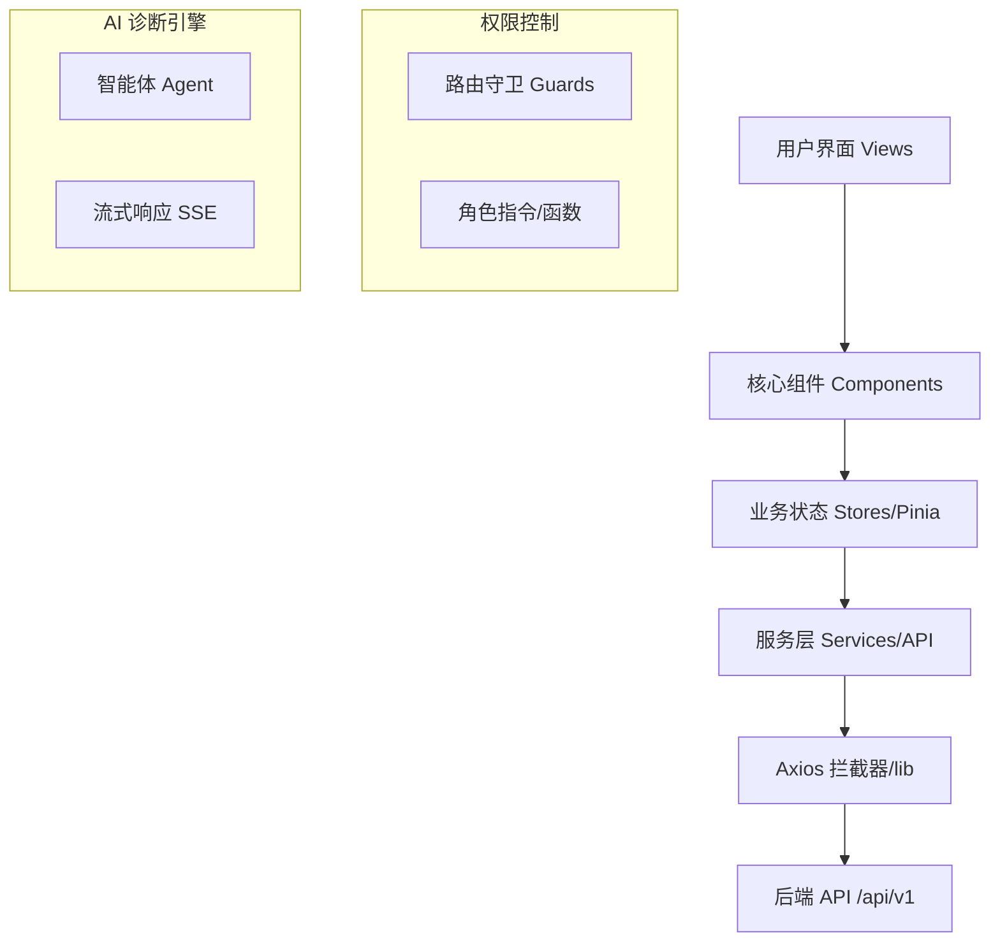

# 前端项目开发与架构指南

## 1. 项目概述

### 项目背景与业务目标

本项目名为 `frontend-vue`，是一个专为大数据集群（如 Hadoop, Spark 等）设计的 **AIOps 智能运维管理平台**。其核心业务目标是通过 AI 智能体协助运维人员进行自动化故障诊断、日志分析及集群状态监控，从而降低运维门槛，提升系统稳定性。

### 技术选型原因

- **Vue 3 (Composition API)**：利用其强大的响应式系统和组件化能力，确保复杂业务逻辑的可维护性。
- **Vite 5**：提供极速的热更新（HMR）和构建性能，大幅提升开发体验。
- **TypeScript**：引入强类型检查，减少生产环境下的运行时错误。
- **Element Plus**：成熟的 UI 组件库，支持深度主题定制，快速构建工业级界面。
- **Pinia**：轻量级状态管理，完美契合 Vue 3 的组合式 API 风格。
- **View Transitions API**: 利用现代浏览器特性，实现平滑的主题切换和页面过渡效果。

### 整体架构图



- **RBAC (Role-Based Access Control)**: 基于角色的访问控制。用户不直接关联权限，而是关联角色（Admin, Operator 等），权限由角色决定。
- **流式响应 (Streaming/SSE)**: AI 生成内容通常较长且耗时。通过流式传输，前端可以实时渲染出“打字机”效果的回复，提升用户体验。
- **集群拓扑 (Cluster Topology)**: 描述集群中节点（Node）之间的物理或逻辑连接关系。

## 2. 开发环境配置

---

- **Node.js**: `^18.0.0` 或更高版本。
- **包管理工具**: 推荐使用 `pnpm` (项目内含 `pnpm-lock.yaml`)。

### 包管理工具：为什么选择 pnpm？

本项目强制使用 `pnpm` 进行依赖管理，其核心优势包括：

- **节省磁盘空间**: 采用内容寻址存储，全局只存一份包文件，通过硬链接分发到各个项目。
- **极速安装**: 避免了重复下载和文件拷贝，安装速度远超 npm/yarn。
- **安全性 (无幽灵依赖)**: pnpm 不会像 npm 那样扁平化 `node_modules`，确保你只能访问 `package.json` 中声明的依赖，避免潜在的引用风险。
- **环境一致性**: [pnpm-lock.yaml](file:///home/devbox/project/frontend-vue/pnpm-lock.yaml) 确保了所有开发人员和 CI 环境下的依赖版本绝对一致。

### 安装指南

```bash

# 克隆项目后执行
pnpm install
```

### 环境要求

项目根目录下需配置 `.env` 相关文件：

- `VITE_API_TARGET`: 后端接口地址（默认 `https://zqpdbakhjwcq.sealoshzh.site`）。
- `VITE_DEV_HOST`: 开发服务器监听地址（默认 `0.0.0.0`）。

### 环境变量设置

## 3. 全量文件地图与职责详解

### 根目录文件

- [package.json](file:///home/devbox/project/frontend-vue/package.json): 项目依赖、脚本定义及元数据。
- [vite.config.ts](file:///home/devbox/project/frontend-vue/vite.config.ts): Vite 构建工具配置，含开发服务器代理、插件配置等。
- [tsconfig.json](file:///home/devbox/project/frontend-vue/tsconfig.json): TypeScript 编译器选项。
- [index.html](file:///home/devbox/project/frontend-vue/index.html): SPA 应用入口 HTML 模板。
- [pnpm-lock.yaml](file:///home/devbox/project/frontend-vue/pnpm-lock.yaml): 锁定依赖版本，确保环境一致性。
- `VITE_DEV_HOST`: 开发服务器监听地址（默认 `0.0.0.0`）。

---

- [main.ts](file:///home/devbox/project/frontend-vue/src/app/main.ts): 应用启动入口，挂载插件（Pinia, Router, ElementPlus）。
- [App.vue](file:///home/devbox/project/frontend-vue/src/app/App.vue): 根布局组件，管理响应式侧边栏显示与移动端遮罩。
- [env.d.ts](file:///home/devbox/project/frontend-vue/src/app/env.d.ts): TS 类型声明，支持 `.vue` 文件及环境变量。

### 源代码目录 (src/app/)

- [index.ts](file:///home/devbox/project/frontend-vue/src/app/api/index.ts): 导出所有服务模块。
- [auth.service.ts](file:///home/devbox/project/frontend-vue/src/app/api/auth.service.ts): 登录、注册及用户凭证接口。
- [cluster.service.ts](file:///home/devbox/project/frontend-vue/src/app/api/cluster.service.ts): 集群增删改查及生命周期管理（Start/Stop）。
- [node.service.ts](file:///home/devbox/project/frontend-vue/src/app/api/node.service.ts): 节点列表及详情查询。
- [log.service.ts](file:///home/devbox/project/frontend-vue/src/app/api/log.service.ts): 集群运行日志检索。
- [diagnosis.service.ts](file:///home/devbox/project/frontend-vue/src/app/api/diagnosis.service.ts): AI 聊天、故障修复及历史记录接口。
- [metric.service.ts](file:///home/devbox/project/frontend-vue/src/app/api/metric.service.ts): CPU、内存等监控指标采集。
- [user.service.ts](file:///home/devbox/project/frontend-vue/src/app/api/user.service.ts): 用户管理及系统日志查询。
- [main.ts](file:///home/devbox/project/frontend-vue/src/app/main.ts): 应用启动入口，挂载插件（Pinia, Router, ElementPlus）。
- [App.vue](file:///home/devbox/project/frontend-vue/src/app/App.vue): 根布局组件，管理响应式侧边栏显示与移动端遮罩。

- [auth.ts](file:///home/devbox/project/frontend-vue/src/app/stores/auth.ts): 管理用户信息、Token 及角色路由跳转逻辑。
- [ui.ts](file:///home/devbox/project/frontend-vue/src/app/stores/ui.ts): 管理侧边栏折叠、暗黑模式切换等 UI 交互状态。
- [cluster.ts](file:///home/devbox/project/frontend-vue/src/app/stores/cluster.ts): 缓存当前选中的集群及节点状态。

- [auth.service.ts](file:///home/devbox/project/frontend-vue/src/app/api/auth.service.ts): 认证相关接口。

- [Sidebar.vue](file:///home/devbox/project/frontend-vue/src/app/components/Sidebar.vue): 权限感知的侧边栏菜单。
- [HeaderNav.vue](file:///home/devbox/project/frontend-vue/src/app/components/HeaderNav.vue): 顶部导航，含面包屑及用户中心入口。
- [LockScreen.vue](file:///home/devbox/project/frontend-vue/src/app/components/LockScreen.vue): 全屏锁定覆盖层。
- [CpuChart.vue](file:///home/devbox/project/frontend-vue/src/app/components/CpuChart.vue) & [MemoryChart.vue](file:///home/devbox/project/frontend-vue/src/app/components/MemoryChart.vue): 基于 ECharts 的监控图表。
- [ExecLogsTable.vue](file:///home/devbox/project/frontend-vue/src/app/components/ExecLogsTable.vue): 复用的执行日志表格。

#### 业务页面 (views/)

- [Login.vue](file:///home/devbox/project/frontend-vue/src/app/views/Login.vue) & [Register.vue](file:///home/devbox/project/frontend-vue/src/app/views/Register.vue): 认证系统。
- [Dashboard.vue](file:///home/devbox/project/frontend-vue/src/app/views/Dashboard.vue): 系统概览及实时指标。
- [Diagnosis.vue](file:///home/devbox/project/frontend-vue/src/app/views/Diagnosis.vue): 核心诊断工作台。
- [ClusterList.vue](file:///home/devbox/project/frontend-vue/src/app/views/ClusterList.vue): 集群资源拓扑管理。
- [Logs.vue](file:///home/devbox/project/frontend-vue/src/app/views/Logs.vue) & [ExecLogs.vue](file:///home/devbox/project/frontend-vue/src/app/views/ExecLogs.vue): 日志中心。
- [UserManagement.vue](file:///home/devbox/project/frontend-vue/src/app/views/UserManagement.vue) & [OperationLogs.vue](file:///home/devbox/project/frontend-vue/src/app/views/OperationLogs.vue): 管理员专属页面。
- [Profile.vue](file:///home/devbox/project/frontend-vue/src/app/views/Profile.vue) & [Account.vue](file:///home/devbox/project/frontend-vue/src/app/views/Account.vue): 个人设置及账号安全。

#### 其他辅助

- [lib/api.ts](file:///home/devbox/project/frontend-vue/src/app/lib/api.ts): Axios 全局拦截器配置。
- [router/index.ts](file:///home/devbox/project/frontend-vue/src/app/router/index.ts): 路由映射表及权限守卫。
- [styles/theme.scss](file:///home/devbox/project/frontend-vue/src/app/styles/theme.scss): 核心配色方案及变量定义。
- [composables/useCharts.ts](file:///home/devbox/project/frontend-vue/src/app/composables/useCharts.ts): ECharts 响应式封装。
- [types/index.ts](file:///home/devbox/project/frontend-vue/src/app/types/index.ts): 全局业务实体类型定义。

---

## 4. 核心功能实现细节

### 权限控制 (RBAC)

采用静态路由配置与动态角色匹配相结合：

1.  路由定义在 [router/index.ts](file:///home/devbox/project/frontend-vue/src/app/router/index.ts) 中，通过 `meta.roles` 标记。
2.  侧边栏通过 [auth.ts](file:///home/devbox/project/frontend-vue/src/app/stores/auth.ts) 中的 `role` 状态动态渲染。

### 主题切换与视觉动效

项目实现了高性能的深色模式切换方案：

1.  **View Transitions**: 在 [Login.vue](file:///home/devbox/project/frontend-vue/src/app/views/Login.vue) 和 [Register.vue](file:///home/devbox/project/frontend-vue/src/app/views/Register.vue) 中使用 `document.startViewTransition` 结合 `clip-path` 动画，实现了平滑的圆形扩散过渡效果。
2.  **CSS 变量驱动**: 样式完全依赖于 [theme.scss](file:///home/devbox/project/frontend-vue/src/app/styles/theme.scss) 定义的语义化变量（如 `--app-card-bg`），确保一键切换主题时的视觉一致性。

### AI 诊断流式输出

[Diagnosis.vue](file:///home/devbox/project/frontend-vue/src/app/views/Diagnosis.vue) 利用 [DiagnosisService](file:///home/devbox/project/frontend-vue/src/app/api/diagnosis.service.ts) 发起请求。前端通过 `fetch` 或扩展的 Axios 接收后端流式数据，实时渲染 Markdown 格式的诊断结果。
Router->>View: 跳转 DefaultPage
end
end

## 5. 开发规范

### AI 诊断助手工作流

- **Vue 组件**: 遵循 `BaseButton.vue` 或 `DiagnosisPanel.vue` 的 PascalCase 风格。
- **服务/工具函数**: 遵循 `cluster.service.ts` 的小写加中划线风格。

2.  前端调用 [DiagnosisService.chat](file:///home/devbox/project/frontend-vue/src/app/api/diagnosis.service.ts#L6)，开启 `stream: true`。
3.  后端逐步返回 SSE 数据包。

严禁使用 Inline Style。所有颜色必须引用自 [theme.scss](file:///home/devbox/project/frontend-vue/src/app/styles/theme.scss)，以便全局适配暗黑模式。

---

## 6. 开发规范

| 术语            | 定义                                     |
| :-------------- | :--------------------------------------- |
| **Agent**       | 诊断智能体，负责分析日志并给出建议。     |
| **Cluster**     | 逻辑上的集群单元，通常包含多个计算节点。 |
| **Pinia Store** | 全局状态仓库，管理跨组件共享的数据。     |

### 样式管理

严禁在组件中使用过多的 Inline Style 或硬编码颜色值。

1.  **变量优先**: 所有颜色、边距、圆角必须引用自 [theme.scss](file:///home/devbox/project/frontend-vue/src/app/styles/theme.scss) 或 Element Plus 变量。
2.  **主题适配**: 编写组件样式时，应优先考虑 CSS 变量（如 `var(--app-text-primary)`），以自动适配深色模式。
3.  **Scoped 样式**: 业务组件必须使用 `<style scoped>`，避免样式污染；全局样式应在 `styles/` 目录下集中维护。

## 术语表 (Glossary)

| 术语                | 定义                                                                                                           |
| :------------------ | :------------------------------------------------------------------------------------------------------------- |
| **Composition API** | Vue 3 的组合式编程模型。                                                                                       |
| **Reactivity**      | 响应式系统，数据的变更能自动驱动视图更新。                                                                     |
| **Agent**           | 智能体，本项目中指代执行诊断任务的 AI 单元。                                                                   |
| **Pinia**           | 项目使用的状态管理库。                                                                                         |
| **Vue Router**      | 官方的路由管理器。负责将 URL 路径与组件进行映射，并实现权限拦截（路由守卫）、页面懒加载等功能。                |
| **npm**             | Node.js 默认的包管理器。负责下载第三方库、管理项目依赖版本以及运行自动化脚本。                                 |
| **SCSS**            | CSS 的预处理语言。它扩展了 CSS 的功能，支持变量、嵌套、逻辑运算等，使样式代码更具模块化和可维护性。            |
| **Vite**            | 下一代前端开发与构建工具。它利用浏览器原生 ES 模块实现极速的开发启动和热更新，并使用 Rollup 进行生产环境打包。 |
| **TypeScript (TS)** | JavaScript 的超集，提供静态类型检查。项目中所有 API 响应和组件 Props 都应定义 Interface 或 Type。              |

---

_相关参考文档：_

- [视觉体验与个性化提升指南.md](file:///home/devbox/project/frontend-vue/docs/视觉体验与个性化提升指南.md)
- [AI 暗黑模式迁移指南.md](file:///home/devbox/project/frontend-vue/docs/AI%20暗黑模式迁移指南.md)
